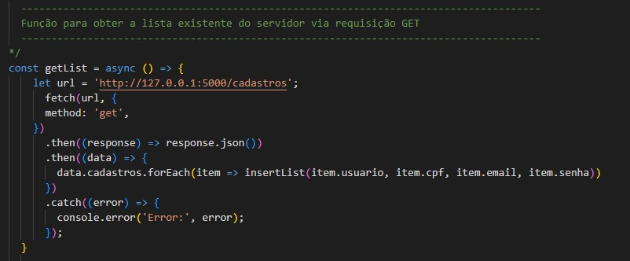
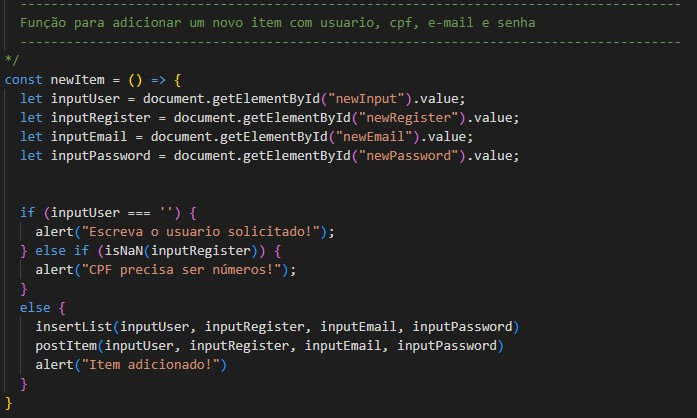

# Formulário de Cadastro

Este projeto referente ao Desenvolvimento MVP - Sprint 1 - Pós graduação em Engenharia de Software da PUC Rio. 

O objetivo aqui é ilutsrar um cadastro de usuários, interagindo atráves das tecnologias HTML, CSS e JS.

## Como executar:

Basta fazer o download do projeto e abrir o arquivo index.html no seu browser.

## Apresentação do projeto:

Desenvolvimento de uma SPA (single page application) criativa e interativa.

Apresenta uma tela de Cadastros e Cadastrados:

## Principais Insights:

Função para obter a lista existente do servidor via requisição GET:

Função para adicionar um novo item com usuario, cpf, e-mail e senha

